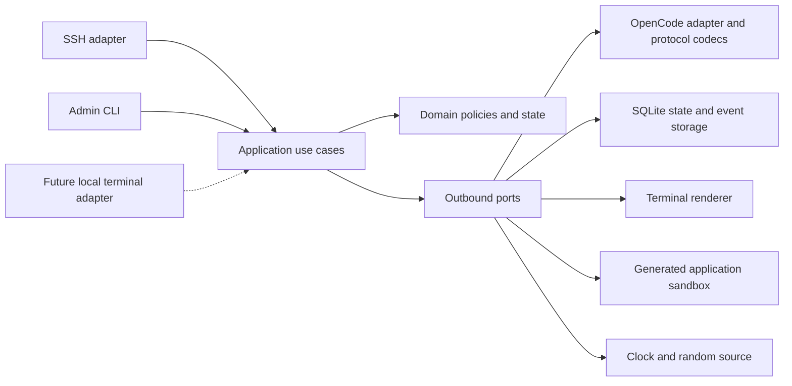

# VibeShell implementation plan

Status: design and implementation plan; application development has not started.

Date: 2026-10-03.

This plan incorporates the user's clarifications during research. It authorizes no deployment or implementation by itself. The supporting evidence, reference revision, catalogue snapshots, and limitations are in [the research findings](docs/research/2026-10-03-findings.md). Engineering rules are in [AGENTS.md](AGENTS.md).

## 1. Product and success criteria

VibeShell is an AI-generated Unix-like shell environment, presented as the shell of a system called VibeOS. A person connects with an ordinary SSH client and encounters a freshly generated MOTD, a familiar GNU/Hurd-style login environment, a Bash-like prompt, plausible Unix command behavior, and interactive terminal programs. Users can invent any program name or open any new file/folder; the AI materializes a plausible persistent presentation instead of being limited to a predefined command catalogue.

No user shell command executes a host/container command. No apparent `curl`, nested `ssh`, package installation, interpreter, or script initiates the corresponding real system operation. The service owns transport, storage, rendering, configuration, model integration, and a restricted application sandbox. AI-generated application logic runs inside that sandbox with capabilities over the simulated world only. The latest user instruction permits this approach in preference to regenerating every application interaction through inference.

The experiment should remain coherent across time. If a user saves a file, another session for that user reads the exact saved bytes. Private user worlds coexist with a shared world. When sharing is enabled, the agent can consult and combine relevant session, user, and cross-user knowledge, and interpret simulated Unix permissions. When sharing is disabled, the service enforces that restriction independently of the model.

Success means that the following demonstration works end to end:

1. Start a single container with durable volumes and one published SSH port.
2. Connect using OpenSSH without a password in public mode, or with a configured password in secure mode.
3. Receive an AI-generated, administrator-configurable MOTD and a plausible `user@vibeos:~$` prompt.
4. Navigate, inspect, create, and edit a simulated filesystem; the system identifies as VibeOS and the shell as VibeShell.
5. Open a second session for the same user and observe committed changes consistently.
6. Use simulated `vi`, `less`, and `top` with responsive editing, navigation, resizing, and exit behavior.
7. Force the current model/account to fail and continue coherently through the configured tiers without duplicate file mutations or repeated output.
8. Reconnect after a service restart and recover the user's persistent world and historical records.
9. Retrieve relevant earlier events through the agent's scoped tools.
10. Export the complete research record, a readable transcript, and a terminal replay.
11. Launch a previously nonexistent program such as `moon-orchard --interactive`, use its generated interface, reopen it later, and have its implementation extended when a new behavior is requested.
12. Open `/archive/cloud-gardens/notes.txt` before it exists, materialize the hierarchy and plausible content, and read the exact committed result again from another session.

## 2. Confirmed scope and deliberate boundaries

| Area | V1 decision |
| --- | --- |
| Presentation | GNU/Hurd appearance and plausible Unix behavior, with VibeOS/VibeShell identity |
| Execution | Simulated system effects; persistent AI-generated app logic in a bounded sandbox |
| Open-ended experience | Any invented program/file/folder can be materialized and later extended |
| Transport | SSH only; core prepared for a later local stdin/stdout adapter |
| Authentication | Configurable public or password-file secure mode; no client key/certificate login |
| Public identity | Username is intentionally claimable by anyone and resumes that username's world/history |
| State | Persistent user worlds, persistent shared world, exact file/fact storage |
| Concurrency | Simultaneous sessions for the same user; independent cwd, foreground program, and terminal state |
| Sharing | Configurable; enabled mode lets the agent use private/user-associated and shared knowledge |
| Terminal | Line editing and full-screen interaction, including vi, less, and top |
| Local mechanics | Generic cursor, buffer editing, scrolling, and redraw operations may run locally |
| Models | OpenCode API provider; free, Go subscription, and configured paid routes |
| Credentials | Multiple keys/accounts in v1; explicit account/quota grouping |
| Routing | Random choice inside ordered tiers; session affinity, failover, cooldown, recovery |
| Research | Permanent events, model/tool/retrieval/routing records, transcripts, terminal replay |
| MOTD | Generated per session using a default prompt the administrator can replace |
| Operations | Container-only development; Podman/Docker-compatible runtime; one exposed port |
| Capacity | Design and benchmark around 100 concurrent users; configurable limits, no fixed 100-user product cap |
| Agent isolation | Each implementation subagent has its own Git worktree and container; the main agent merges and validates integration |

Out of scope for v1: real Unix command execution, a real GNU/Hurd kernel, a complete Bash/POSIX implementation, perfect emulation of every terminal application, SSH forwarding, SFTP/SCP, client certificate/key authentication, additional public transports, a web administration UI, distributed clustering, and automatic external publication of research data.

`vi`, `less`, and `top` are concrete acceptance examples, not an allowlist of applications. Previously unknown programs, options, files, and folders enter the generation/extension path. Plausible behavior is required; perfect compatibility with every existing Unix implementation is not promised.

## 3. Technology and architectural decisions

### 3.1 Go application with an owned simulation runtime

Use Go for the service, domain, simulation orchestration, and administration executable. Use `j0s.at/vibeshell` as the module path. Normal packages use ordinary lowercase Go names; do not reproduce Java-style reverse-domain package hierarchies. Domain ownership does not automatically publish a Go vanity import endpoint; that can be added separately if public module consumption is needed.

The runtime combines an application-owned agent loop with a bounded generated-application engine. The loop constructs context, calls a provider, validates proposed application/content changes, tests candidates, and commits accepted versions. Existing applications handle routine events locally and can request AI extension when their behavior is incomplete. There is no dependency on an OpenCode CLI/server or a general-purpose coding-agent process.

Reasons: the application needs strict control over state commits, scopes, retries, terminal frames, and transcripts. A coding runtime with filesystem/shell access introduces capabilities the simulation does not need. Go fits a standalone executable and many mostly idle network connections. TypeScript with ssh2 and Python with AsyncSSH remain credible alternatives; their model integrations are convenient, but they do not outweigh Go's deployment and lifecycle advantages for this service.

### 3.2 Libraries and standard components

| Concern | Selected direction | Validation before implementation depends on it |
| --- | --- | --- |
| SSH protocol | `golang.org/x/crypto/ssh` | Public `none` auth, password auth, PTY/window requests, disconnects, channel refusal |
| Terminal input/rendering | Generic state machine using Charm ANSI/Ultraviolet primitives where useful | Byte-stream operation over SSH, fragmented key sequences, resize, wide characters, no process-global terminal assumptions |
| Generated applications | JavaScript interpreted by a pinned QuickJS Wasm build inside `github.com/tetratelabs/wazero` | Isolation, memory/time bounds, JSON boundary, cancellation, cold start, concurrent-instance benchmarks |
| Local terminal utilities | `golang.org/x/term` where appropriate | Must not become a dependency of the domain or an assumption that SSH owns a local OS PTY |
| Provider transport | Go `net/http` and explicit protocol codecs behind one model port | SSE parsing, tool calls, cancellation, status/error normalization, bounded bodies |
| Storage | `database/sql` and `modernc.org/sqlite`, SQLite WAL + FTS5 | FTS5 availability, race tests, transaction behavior, backup/restore, container volume behavior |
| Password hashes | Argon2id through `golang.org/x/crypto/argon2` | Encoded hash parsing, bounded work parameters, timing-safe verification |
| Structured contracts | Versioned JSON schemas and typed Go structures | Reject unknown actions, bounds violations, invalid references, malformed tool arguments |
| Configuration | Strict JSON files with schema and semantic validation | Secret references, duplicate IDs, invalid tiers and policy combinations |
| Tests | Go testing, fuzzing, race detector, scripted SSH clients in containers | Deterministic policy tests plus real protocol tests |
| Containers | Multi-stage Containerfile; Linux runtime image with CA roots | Rootless Podman, non-root container process, Docker-compatible build/run |

Do not add an agent framework, message broker, vector database, or separate database service in v1. Add a library only for a demonstrated need and record its tradeoff. Pin the current supported Go patch release, module versions, and container image digests in the foundation task; do not base released builds on floating `latest` tags.

The terminal spike may choose a small local stream adapter over Ultraviolet if the latter's runtime assumes ownership of a process terminal. This is a bounded library decision, not permission to redesign the application around a TUI framework.

### 3.3 Hexagonal boundaries

The transport owns connection details; the application owns sessions and turns; the domain owns invariants and routing/state rules. Adapters perform I/O. The composition root constructs dependencies and controls lifecycle.

Proposed layout:

| Path | Ownership |
| --- | --- |
| `cmd/vibeshell` | Server/admin entry points and dependency wiring |
| `internal/domain` | IDs, state invariants, scope, route and health policies; no I/O |
| `internal/application` | Session, turn, recovery, export, and admin use cases |
| `internal/ports` | Small inbound/outbound contracts; no adapter types |
| `internal/simulation` | Prompt construction, bounded tool loop, response validation, context assembly |
| `internal/apps` | Application manifests, immutable versions, validation, activation, extension, and state compatibility |
| `internal/adapters/sandbox` | QuickJS/Wasm bridge with bounded JSON inputs/outputs and no real-world capabilities |
| `internal/terminal` | Input decoder, editable buffers, screen model, renderer, declarative interactions |
| `internal/adapters/ssh` | SSH auth, channels, terminal negotiation, stream lifecycle |
| `internal/adapters/opencode` | Product routes, catalogue loading, credentials, HTTP and protocol conversion |
| `internal/adapters/sqlite` | Migrations, world/event transactions, indexes, recovery, backup |
| `internal/adapters/config` | Strict parsing, schemas, secret references, configuration reload |
| `internal/adapters/system` | Real clock, randomness, host lifecycle boundaries |
| `schemas` | Versioned configuration, event, tool, and simulation contracts |
| `prompts` | Versioned administrator-editable defaults |
| `tests/contract`, `tests/integration`, `tests/e2e`, `tests/load` | Fixtures and higher-level checks |
| `containers`, `scripts` | Container builds and thin invocation helpers |
| `docs/adr`, `docs/tasks`, `docs/research` | Decisions, independently owned work, and evidence |

Physical package splits may be smaller where that improves cohesion. Never put business behavior in `cmd`, the SSH handler, or provider codecs merely to avoid an interface.

## 4. Identity, authentication, and SSH behavior

### 4.1 Identity

- Give every durable user a generated internal ID. Keep the presented username separate from filesystem paths and database keys.
- Public mode maps an accepted username to its persistent public identity. Reclaiming a name intentionally reclaims that identity's history and world.
- Secure mode maps a username in the configured password file to an internal secure identity. Public and secure identity namespaces are separate by default so switching modes does not expose secure history through an unauthenticated name. Any migration between them is an explicit administrative operation.
- Accept broad UTF-8 usernames subject to length and terminal/control-character validation; do not interpolate names into real paths or commands. Do not silently lowercase or normalize distinct usernames into the same identity. Display escaping and home-path encoding must be deterministic.
- `root` is a simulated identity; it grants no host privileges. Neither simulated `su` nor `sudo` changes the real authenticated principal or the hard sharing configuration.

### 4.2 Secure password file

Use a versioned file containing username, encoded Argon2id password hash, enabled status, and stable identity reference when needed. Provide admin operations to add/update/disable users and generate hashes inside the container. Read passwords from a TTY or stdin, never a command-line argument.

Hash parameters are calibrated in the container and bounded when reading the file so malformed parameters cannot request unreasonable memory/CPU. Use dummy verification for unknown users to reduce obvious timing differences. Limit simultaneous authentication work, attempts per connection, and abusive connection rates; these are transport controls, independent of AI.

Load a new password file atomically after validation. Disabling a user prevents new sessions; an explicit admin operation can also disconnect existing sessions. Password and hash values are never model context or research records.

### 4.3 SSH channel contract

- Public mode uses SSH `none` authentication; it does not require a blank password prompt.
- Secure mode advertises password authentication only. Do not register client public-key/certificate authentication.
- Generate or load a persistent SSH host key in the durable service volume. Host authentication still exists even though client-key login is not supported.
- Support session channels, `pty-req`, `shell`, `window-change`, ordinary stdin/stdout, SSH signals where sent, EOF, and exit status. Validate every request payload and bound dimensions/input sizes.
- Accept only appropriate locale/terminal environment requests; never apply client variables to the process environment.
- V1 supports interactive shell sessions. Refuse SSH `exec`, subsystem, forwarding, X11, agent forwarding, and unsupported channel/request types clearly. No request falls through to an operating-system shell.
- Each SSH shell channel creates its own application session. Multiple channels/connections for one user share durable world state but not cwd, editor buffers, or foreground program state.
- Use bounded input/output queues and cancellation. A slow client must not block other sessions or create unbounded memory use.
- On disconnect, cancel pending model work, record termination, discard uncommitted world changes, and close connection resources. Already committed changes remain durable.
- Expose a configurable container port such as 2222, published to the administrator's chosen host port. Only that service port is public.

## 5. World model and consistency

### 5.1 Separate durable state from historical evidence

Keep three concepts explicit: current world state, append-only events describing what happened, and derived context/search summaries. A retrieved old transcript never silently overwrites a newer file or fact.

Durable objects include filesystem nodes and exact content, installed-package facts, simulated users/groups/permissions, environment defaults, system identity, and durable simulated service/process facts where relevant. An apparent installed package is stored as a fact; no real installation occurs.

Each node has an opaque ID, namespace owner, parent/name, node kind, revision, logical metadata, and optional content reference. Preserve file bytes exactly. The initial supported file kinds are regular files, directories, and simulated symlinks; special files are simulated views, not physical host devices.

Content is immutable and content-addressed within the database; metadata refers to a content hash/ID. Start with database BLOB storage to keep content and metadata commits atomic. Add a separate blob store only if measurements justify it and its crash protocol is specified.

### 5.2 Scopes and path resolution

| Scope | Examples | Lifetime and access |
| --- | --- | --- |
| Session | cwd, shell variables, last exit status, foreground interaction, terminal size, unsaved editor buffer | One connection/session; research checkpoints persist |
| User world | Home files, personal modifications, user-associated facts and summaries | Permanent; shared by that user's parallel sessions |
| Shared world | Common simulated machine facts/files and globally adopted changes | Permanent; available only when sharing is enabled |
| Baseline | Versioned clean-install seed identity and minimal directory skeleton | Immutable starting material; never an access path into another user's data |

Resolve paths deterministically from session cwd and the effective user/shared view. User overlays take precedence over shared/baseline entries, with tombstones representing deletions. By default, writes are user-associated; the agent can explicitly choose a shared target when sharing is enabled. Persist that choice so repeated reads do not depend on the next model inventing a different scope.

Home directories follow the visible `/home/<username>` convention, with a defined display/path encoding for unusual names. Agent tools can inspect another user's home when cross-user sharing is enabled; the agent can allow or deny simulated access according to its interpretation of stored Unix permission facts. User-associated storage is therefore not a promise of confidentiality when sharing is enabled.

An administrator can turn sharing off. The service then rejects shared-world/other-user reads, writes, transcript retrieval, and summaries at the tool boundary, regardless of model requests. All scope filters are injected by trusted application context, not accepted unchecked from model-supplied IDs.

Proposed default: sharing enabled, matching this experiment's shared-world requirement. Disabling it prevents future cross-user access; it does not erase facts previously copied into the current user's files or events. On a live scope-policy change, invalidate cross-scope caches and rebuild model context under a new policy revision before accepting another turn.

### 5.3 Exactness and concurrency

- A turn reads a versioned snapshot and creates a bounded staged change set. Tools in that turn can see staged changes, but other sessions cannot.
- Store read/write dependency versions, including directory membership revisions and absence checks where necessary. This prevents a stale listing or failed existence check from validating an invalid write.
- At commit, verify relevant versions in one short database transaction. Persist world changes, accepted response/frame references, and the turn outcome atomically.
- On conflict, refresh affected state and ask the agent to rebase/re-evaluate within a bounded retry budget. Never silently overwrite another session's changes. A conflict is not a model-health failure.
- Do not hold database transactions or global user locks while waiting for an API response. Concurrent turns can generate independently; their accepted writes serialize at commit.
- Reads after an acknowledged commit observe that version or a later one. A response generated from an earlier consistent snapshot is labeled with its source version in research records.
- Use content references for exact file output. Literal text from user input and editor buffers is passed by validated reference where possible rather than asking a model to reproduce every byte.
- `cd` changes session cwd only; a file write changes the selected durable namespace. Parallel sessions' cwd must never overwrite one another.
- Symlinks and `..` resolve inside the simulated namespace. No path becomes a real host/container path.
- Deleting a simulated file removes it from the current view, not from historical research events. The simulated machine cannot erase its audit record.

### 5.4 Initial world

Ship a small versioned skeleton with `/`, `/home`, `/root`, `/tmp`, `/etc`, `/usr`, `/bin`, `/dev`, and `/proc`-like simulated views as appropriate to the chosen GNU/Hurd presentation. Seed only identity and structural facts; have the model materialize plausible additional contents on demand and commit them before they are shown as durable facts.

Present VibeOS in `uname`, OS-release-style views, and the MOTD, and VibeShell in shell identification. Do not report the real container kernel, hostname, process list, resource usage, or environment. A style document will specify the plausible GNU/Hurd baseline without claiming complete implementation of a particular Debian release.

### 5.5 Materialize anything, then preserve it

A name is not rejected merely because no implementation or stored path exists yet. Resolve unknown program invocations through application generation. Resolve unexplored paths through world generation: infer plausible purpose from the path, command, surrounding world, and permitted history, then create the required parent directories, metadata, and contents as one staged change set.

Generated content becomes authoritative only on commit. Later reads use exact stored bytes. Directory listings must be consistent with materialized children; discovering a new child is recorded as a world change rather than silently rewriting an earlier listing. Concurrent first access to the same shared path has one winning version; losing attempts re-read that committed version.

For an unknown program, produce a plausible interface even if its name is invented. Unsupported options and modes should trigger extension of its existing artifact rather than a hardcoded `command not found` response. Explicit simulated permission decisions, deliberate deletion records, and existing state remain consistency constraints. A deleted file is not silently restored from an old transcript; any re-materialization is a new recorded creation.

### 5.6 Persistent generated application artifacts

Store an immutable artifact for each accepted version: app ID, visible command names/aliases, owner/scope, manifest/ABI version, JavaScript source, source hash, description, state schema, requested simulated capabilities, parent version, prompt/model provenance, validation results, and activation event.

Existing sessions pin their application version and state. New sessions use the current accepted version. An extension creates a candidate version; validate and smoke-test it before atomically activating it. Keep the previous version available for rollback and research. Never overwrite a working artifact with partially streamed or syntactically invalid source.

App state is explicit serializable data, with separate session and durable user/shared portions. Prefer additive migrations. If a new version cannot interpret existing state, retain the old version for active sessions and use a verified migration or fresh session state; never silently discard saved files.

The generated-app ABI receives bounded event/state/world-view inputs and returns new local state, a declarative view, bounded simulated effect proposals, requested world reads, or a request for AI assistance/extension. World effects use the same staging, scope, conflict, and commit machinery as agent turns. Generated code cannot directly query the database or call model APIs.

### 5.7 Sandbox choice and qualification gate

Select a QuickJS WebAssembly guest embedded in wazero, with a small audited JSON bridge. JavaScript is a familiar generation target and handles arbitrary event-driven programs; WebAssembly provides a bounded guest memory boundary. Persist source, not engine-specific bytecode, as the long-term artifact. Any compiled cache is derived and tied to the exact engine version.

The inspected `fastschema/qjs` project is useful reference material, but its stock adapter mounts the current working directory into WASI. Do not adopt that default. The VibeShell adapter must provide no host directory mounts, environment, sockets, process execution, dynamic native modules, or unrestricted Go object/function proxies. Prefer a minimal QuickJS build without std/os modules; any required WASI imports receive capability-free or explicitly bounded implementations.

Apply both guest-memory and JavaScript-heap/stack limits, execution deadlines/cancellation, bounded serialization/output, bounded event queues, and total-instance admission limits. Supply simulated time and seeded randomness explicitly for reproducibility. Host bridge operations must also be bounded; guest cancellation alone does not cancel a blocking host callback.

Compile/cache the engine once and instantiate isolated app runtimes. Reuse immutable compiled engine code, never mutable state across users. Idle instances can be evicted and restored from explicit state; do not allocate the maximum guest memory for every connected idle user.

Before implementation relies on this selection, run a container-only qualification spike covering infinite loops, allocation exhaustion, recursion, malformed JSON, forbidden import/filesystem/network attempts, cancellation, state leakage, and 100-user resource behavior. If the adapter cannot meet these gates, choose another bounded Wasm embedding behind the same port; do not weaken the isolation contract or quietly fall back to native command execution. Documentation/source inspection has been completed; execution-level qualification has not.

## 6. Terminal and interactive simulation

### 6.1 Input and output mechanics

The terminal layer consumes byte streams and terminal metadata, not an operating-system shell. Decode UTF-8, control keys, fragmented escape sequences, bracketed paste, and resize events. Bound incomplete escape sequences and paste/input queues. Negotiate a conservative ANSI/xterm feature set, with a documented plain-terminal fallback.

The local layer handles editing the current command line, cursor movement, history navigation, selection of cached completions, screen diffs, and foreground-buffer editing. These actions do not call a model. Submitted commands, semantic application actions, and unresolved completion requests enter the simulation loop.

Line mode includes backspace/delete, arrows, Home/End, common Emacs-style movement/erase keys, history up/down, and bracketed multiline paste. Persist accepted commands for history; keep simultaneous sessions' draft lines separate. Tab completion uses committed path/command facts first, with an optional AI request when necessary; showing a completion must not execute it. Generated application handlers run local semantic actions where implemented; missing behavior routes to the agent for extension.

Handle Ctrl-C locally and immediately: cancel the active turn/tool loop, mark the turn interrupted, discard uncommitted state, restore a usable screen/prompt, and ignore late responses by turn generation ID. Handle EOF and explicit exit cleanly. Ctrl-D on a nonempty input buffer follows the local editor contract; on an empty shell prompt it closes the session. Key handling must remain responsive while a provider is slow.

Use an owned screen model: cells, cursor, style, viewport, scrollback policy, and alternate-screen state. Account for wide characters, combining marks, tabs, CR/LF, and terminal dimensions. The renderer emits terminal control sequences; the model does not emit arbitrary control sequences directly. Text displayed as data must not activate clipboard, hyperlink, title-change, or other unapproved terminal controls.

### 6.2 Declarative application interactions

Have generated applications return a bounded declarative interaction description: display mode, buffer/data references, status text, key bindings to approved primitive actions, and events handled by sandboxed app logic or requiring another model decision. JavaScript logic stays in the restricted guest; the view remains validated data consumed by the trusted terminal renderer.

Allowed primitives include moving a cursor, editing an in-memory text buffer, selecting a range, searching a buffer, scrolling a viewport, updating a status line, switching a declared mode, and emitting a semantic event. They have resource limits and cannot perform I/O. Saving files, modifying shared facts, or leaving an application follows the application/world commit path.

The initial runtime supports reusable text-editor, pager, and table/status-screen primitives, plus general cell/text/form views and sandboxed event handlers. It does not implement an actual vi/less/top process. Prompt fixtures and contract examples show the model how to compose these into arbitrary plausible applications. Unsupported bindings can trigger artifact extension; routine implemented interactions remain deterministic and tested.

### 6.3 V1 interaction contracts

| Simulation | Required behavior | AI participation |
| --- | --- | --- |
| Shell | Prompt, commands, pipes/redirections, history, completion, Ctrl-C, exit, stdin-like prompts | Resolves or generates app behavior; existing artifact logic can handle implemented commands locally |
| vi | Normal/insert modes; h/j/k/l and arrows; basic word/line movement; insert/delete; undo/redo; search; `:w`, `:q`, `:q!`, `:wq`; dirty-buffer indication; resize | Opens the appropriate simulated file, chooses the interaction, interprets semantic commands, requests validated saves |
| less | Exact referenced file content; line/page scrolling; search; top/bottom; quit; resize | Chooses the pager and opening behavior; no API call for ordinary navigation |
| top | Plausible simulated process/system data; local table navigation; sorting; quit; resize; periodic refresh | Generates/updates simulated data; never reads real container processes or performance counters |
| REPL/prompt | Line-oriented input, continuation prompts, exit/interrupt | Generates or extends interpreter behavior; stored app logic handles known behavior locally |

Counts, registers, macros, advanced ex commands, terminal mouse protocols, and full Bash job control are not acceptance requirements for the first milestone. Unknown interactions enter the model-driven generation/extension path and must never fall through to a real executable. The runtime API must be general enough that adding a new application does not require a Go code change.

Refresh top-like screens only while visible/active, coalesce refresh requests, and bound their frequency and token budget. Animate or redraw already generated data locally where it is truthful to the simulated state. Do not turn 100 idle screens into continuous model traffic.

Common shell composition must have meaningful data flow: stdout/stderr and exit status are distinct; `|` passes the accepted output of one simulated app to another; `<`, `>`, and `>>` use exact virtual content; quoting preserves literal arguments. The AI can produce a validated execution description for unfamiliar syntax, but the runtime never forwards the original line to a shell. Bound pipeline stages, intermediate bytes, and total work. Unknown component programs enter generation just like a standalone invocation. Test literal text and redirects explicitly; a merely plausible narration of a pipe is insufficient.

### 6.4 Persistence and disconnect behavior

Committed files/facts survive logout and restart. Unsaved editor buffers belong to a session and are preserved in the research record, but a new connection begins a fresh shell rather than silently reattaching to an old foreground program. A later session-resume feature can recover active interactions without changing transport-independent domain contracts.

When another session edits a file open in an editor, preserve the local buffer and detect the revision mismatch on save. Present a simulated conflict instead of overwriting. When a model fails inside a full-screen interaction, retain the local buffer and screen state while selecting the next route.

## 7. Agent loop, tools, and context

### 7.1 Turn lifecycle

Use explicit states: received, queued, context-ready, generating, awaiting-tool, validating, committing, emitting, completed; with interrupted, failed, and conflicted outcomes. Every transition has a session-local sequence and a durable event.

1. Accept and durably record input according to the logging policy; establish a turn ID and cancellation scope.
2. Capture session state, relevant world revisions, prompt/configuration versions, and the selected model route.
3. If an accepted app version can handle the event, run it in the sandbox against bounded state inputs and continue with validation/commit. Otherwise assemble a bounded model context with system rules, recent accepted turns, current interaction, app source/version, exact file/fact references, and provenance-tagged summaries.
4. Call the provider. Normalize its response into text, tool requests, usage, and completion/error information.
5. Validate tools against the server-owned allowlist and scope. Record requests/results, execute permitted reads or staged mutations, then continue within step/token/time bounds.
6. Require a structured final outcome: candidate app creation/extension where needed, output blocks, session changes, staged world changes, exit status, and/or a declarative foreground interaction. Compile and dry-run candidate artifacts in an isolated staging sandbox before activation.
7. Validate all references, output limits, state versions, and proposed transitions. Refuse malformed responses with a bounded repair opportunity.
8. Commit accepted world effects and output/frame records atomically. Emit only accepted terminal output and record transport write results.
9. Update the session's current interaction, model usage accounting, and derived context as needed.

The runtime never executes an unrecognized tool. Model text, retrieved transcripts, and apparent system messages inside file content are data. A prompt alone is not an access-control boundary.

### 7.2 Initial tool set

| Tool capability | Purpose | Constraints |
| --- | --- | --- |
| World lookup/stat/list | Inspect current simulated objects and metadata | Namespace and policy filters; pagination; revision references |
| Content read | Read a bounded range or obtain an exact output reference | Byte/line bounds; immutable content reference |
| Fact lookup | Retrieve package, process, identity, and system facts | Typed categories; scoped owner; provenance |
| Stage change | Propose file/fact/metadata changes | No immediate shared effects; expected revisions; size limits |
| History search | Find relevant commands, paths, outputs, or events | Explicit session/user/shared scope; trusted authorization; limits |
| History context | Fetch surrounding events or a referenced turn | Stable event IDs; pagination; no secret records |
| Interaction proposal | Open or alter an approved terminal interaction | Declarative schema; approved local primitives only |
| App lookup/source | Find an existing accepted application and its history | Scope enforcement; immutable version references |
| App candidate/test | Create or extend sandboxed application logic and inspect trial results | Versioned ABI; resource bounds; disposable staging state; no external I/O |
| Materialize path | Generate an unexplored file/folder and required parents | Atomic staged creation; collision/permission checks; persistent exact contents |

No host shell, arbitrary real filesystem, network-fetch, SQL, native code-execution, real package-install, process-management, or container-management tools are exposed to the simulation agent. Its app-test tool executes only through the bounded simulated-world sandbox. Provider HTTP requests are made by the service, not by user-directed network tools.

### 7.3 Context and long-term memory

- Keep a canonical provider-neutral turn history; provider adapters translate it. Switching models does not switch the session's memory store.
- Include prompt identity, true transport-independent session/user identifiers, current cwd/environment, active interaction, latest relevant state revisions, and recent turns.
- Budget against the selected model's context and output limits. Reserve room for tool results and the final response before sending.
- Summarize older history into derived records with source event ranges, model/prompt version, and scope provenance. Never delete raw events during compaction.
- Let the agent search at any step. Support exact command matching, normalized path matching, full-text matching, time ranges, and surrounding context.
- Treat user-level summaries and shared-world summaries separately. A disabled sharing policy must not admit an old shared summary through a cache or convenience prompt.
- A model change can require re-budgeting or re-summarizing context. A context-length rejection first triggers context repair rather than globally quarantining a healthy model.
- Search results show scope, time, session, source command, cwd, and state version so the agent can distinguish an old example from current truth.
- Add embeddings only if retrieval evaluation demonstrates a need. Exact paths/commands and FTS5 are the initial implementation.

### 7.4 MOTD and prompt administration

Generate a new MOTD once for each accepted shell session. The administrator controls a versioned prompt file. Its default asks for a short, plausible GNU/Hurd-style welcome branded VibeOS, followed by the familiar VibeShell prompt, with no Markdown fences or model commentary.

Provide factual inputs: displayed username, session time, enabled sharing mode, and permanent research-recording status. The default prompt should mention the simulation/recording succinctly as part of the welcome; its wording is configurable rather than a fixed hardcoded paragraph. Record the exact prompt version, relevant variables, model route, and generated MOTD.

Draft default MOTD prompt for the implementation:

> Write a fresh, concise login message for VibeOS, a plausible GNU/Hurd-style simulated machine whose shell is VibeShell. Address the current user using the supplied session facts. Use the tone and plain terminal formatting of a freshly installed Unix system, with a little variation on each login. Briefly reflect the supplied permanent-recording and sharing status accurately. Do not invent host details, previous logins, messages, or user activity that are not in the supplied facts. Return only MOTD text: no Markdown fences, chatbot commentary, shell prompt, or terminal control sequences. Keep the welcome within the configured line budget.

The trusted renderer adds the prompt afterward, using accepted session state. The administrator can replace this text while hard runtime boundaries remain enforced.

Do not let an edited presentation prompt enable real execution or expand hard scope/tool permissions. Validate prompt files before reload. Existing turns pin their prompt/configuration snapshot; the next turn/session uses the updated permitted version.

## 8. Model catalogue, accounts, and routing

### 8.1 Provider versus product versus protocol

OpenCode is the initial provider. Console/free/pay-as-you-go and Go are product routes; Chat Completions, Responses, Messages, and Gemini-style generation are wire protocols. A model's ID alone does not identify all three.

Each configured model route identifies provider, product, exact model ID, protocol/capability metadata, eligible account pool, and any operator overrides. Use exact upstream model IDs in requests. Preserve the product route during failover unless a tier explicitly permits another one.

Implement OpenCode's documented protocol families behind one `ModelGateway` port. V1 must support the families used by configured OpenCode text/tool models, including non-Chat-Completions routes; do not advertise a Gemini/Responses/Messages model while silently sending it to a chat endpoint. Non-generative/specialized models are excluded from automatic shell selection.

### 8.2 Keys and quota groups

An account has a stable administrative ID, provider/product eligibility, quota-group ID, and one or more secret references. Multiple keys can belong to one account; keys are not assumed to multiply its quota. Separate accounts can be mixed in the same tier.

Resolve secrets from mounted files or container environment. Never copy key contents into the model catalogue, database research events, configuration exports, or error messages. Research events use opaque account/key-reference IDs that do not reveal values.

Select a model route independently of the number of available keys. After choosing a route, choose a healthy eligible account fairly; within an account use its configured valid credential. Adding a second key should not accidentally double a model's probability of selection.

### 8.3 Suitable-free discovery

1. Refresh the relevant OpenCode product catalogue on a configurable interval and retain a last-successful snapshot.
2. Expand an automatic-free entry using IDs ending in `-free`, as requested by the user.
3. Intersect with supported text generation, tool/structured interaction capabilities, protocol support, and minimum configured context requirements.
4. Check known pricing metadata for the same product route. Known nonzero cost excludes the model from automatic-free selection; missing/contradictory metadata requires an explicit operator decision rather than being treated as zero.
5. Apply administrator allow/deny rules and model-health/account availability.
6. Deduplicate explicit/automatic entries referring to the same route within a tier.

An explicitly named route can include a free model without the suffix, such as the observed Big Pickle exception. Subscription-included usage is distinct from genuinely zero-price/free routes. Do not classify all Go models as free merely because usage is included in a subscription.

Catalogue discovery succeeds without an API key, but it does not prove account entitlement or model health. Cache metadata with its source, fetch time, and hash. If refresh fails, use the permitted last-known catalogue within its configured age; do not invent new models or paid fallbacks.

### 8.4 Initial selection and session affinity

- At connect, expand the configured tiers under one catalogue/configuration snapshot.
- Find the first tier with at least one eligible route/account combination. Choose a route uniformly at random among eligible distinct routes, then an account using the account policy.
- Pin that route/account to the session until a failure requires a change. Record the eligible set and chosen route for research; deterministic tests inject a known random source.
- On a route/account failure, first try another eligible account for that route if appropriate, then another randomly ordered unused route in the same tier. Advance only after the tier has no remaining eligible combinations for the attempt.
- Avoid retry loops through duplicate entries and keys in the same exhausted quota group.
- Recovery makes a route eligible for future selections. Do not migrate a healthy active session back to an earlier tier just because it recovered; this preserves session affinity and avoids unnecessary context churn.
- A total turn deadline and attempt budget bound work. If they expire before the tier is exhausted, end the turn with a temporary simulated service error rather than silently bypassing the tier order.

## 9. Failure classification, retry, and output safety

### 9.1 Failure scope

| Failure | Response | Health scope |
| --- | --- | --- |
| Invalid/revoked credential | Disable that credential temporarily; try another allowed credential/account | Credential, with account escalation only if supported by the error |
| Account/product quota or balance exhausted | Respect known reset/cooldown; use another eligible account/route | Account or quota group and product/model as reported |
| Provider rate limit | Honor Retry-After; avoid bursts across keys sharing a quota group | Narrowest evidenced rate-limit scope |
| Model removed/not found | Refresh catalogue and quarantine the route | Provider + product + model |
| Provider outage/5xx/network timeout | Bounded retry/failover with jitter and shared outage suppression | Route or broader product/provider when evidence supports it |
| Context too long | Rebuild/compact context once within budget | Current request; do not disable the model globally |
| Invalid tool arguments/response schema | Give bounded repair feedback, then use another candidate if necessary | Current response initially; repeated incompatibility can quarantine the route |
| Content rejection or unsupported request | Record and handle explicitly; do not call it a quota failure | Request/capability |
| User cancellation | Abort promptly and discard staging | No health penalty |
| Concurrent world conflict | Refresh and re-evaluate the turn | No provider-health penalty |

Use available structured error fields and HTTP status together. Redact credentials before persisting error details. Unknown errors get bounded treatment and a diagnostic category; they are never considered success just because HTTP returned 200.

### 9.2 Recovery state machine

Health records move through healthy, cooling-down, probe-eligible, probing, and healthy/quarantined again. Persist failure reason, affected scope, last attempt, consecutive failures, next probe time, and last known success.

Honor authoritative reset/Retry-After information; otherwise use configurable exponential backoff with jitter and a maximum. Use monotonic durations while running and durable wall-clock timestamps for restart recovery. Only one probe may run for a health key at a time.

Catalogue checks can restore knowledge that a removed model exists, but a successful bounded inference/tool-capability probe is stronger evidence of usability. Probe budgets are configurable; health checks must not create unlimited paid background traffic. Do not probe every model continuously. Prefer a due half-open candidate during a real request, or a bounded scheduler probe when configured.

An account-level quota applies to its grouped keys. A free route may also encounter shared service/IP capacity limits; blindly cycling keys must not be assumed to fix that.

### 9.3 Time, cost, and local limits

Expose independent limits for connection establishment, first response, stream inactivity, whole request, whole turn, model steps, output size, tool calls, and total attempts. Provide documented operational defaults after the latency spike; do not leave a public session hung on an unbounded SDK retry loop.

Spending limits are optional configuration at instance, account, user, and session scopes. The user did not specify a fixed monetary ceiling. Never automatically add a paid route: only configured tiers make one eligible. Reserve estimated maximum cost before a paid request and reconcile reported usage afterward; parallel requests must not all spend the same remaining budget. Label unknown usage/cost estimates explicitly.

Go's provider-side balance fallback can affect billing outside VibeShell's tier transitions. Document the operator setting and test it with the intended account setup; application estimates are not a promise to override the provider's own billing behavior.

### 9.4 Retry and emission boundaries

Default to buffering a semantic turn or full-screen update until it validates and commits. This permits changing models without showing duplicate partial answers or applying writes twice. Local input editing remains immediate.

Large content output can stream immutable, already committed content references in chunks. Record each chunk and the write outcome. Model-generated partial text that has already been shown cannot be taken back; if a later version adds direct token streaming, it needs an explicit partial-output continuation/error protocol and separate acceptance tests.

Use turn IDs, attempt IDs, and idempotency keys internally. On retry, discard uncommitted candidate mutations, preserve accepted context and current local buffers, and avoid replaying committed mutations. A late response from an interrupted/replaced attempt cannot update the screen or world.

## 10. Permanent research storage and export

### 10.1 Event envelope

Every event has a schema version, immutable event ID, session ID, per-session sequence, UTC timestamp, monotonic offset within the recording, event kind, payload, provenance, and relevant user/turn/attempt/app-version/state-revision references. Transport records also identify the connection/channel without making those IDs the domain identity.

Distinguish received input, decoded input, accepted semantic action, generated output, committed output, and transport write outcome. A successful SSH write means handed to the transport, not proof the person read it. Do not label generated-but-rejected output as user-visible.

Store binary terminal data losslessly, with an explicit encoding for JSON export. Normalized text/search projections are derived. Order by sequence rather than timestamps alone; record clock/source information needed to interpret duration. If one operation touches user and shared worlds, link all affected revisions to its accepted turn.

Event categories:

| Category | Required record |
| --- | --- |
| Session | Connect, authenticated identity, terminal metadata, start, end, disconnect reason, recovery |
| Input | Raw/decoded terminal events, resize, paste boundaries, accepted command or app action |
| Terminal | Accepted frames/output chunks, prompt, screen-mode transitions, write success/failure |
| Model | Exact sanitized request/response, model route, account reference, timing, usage, finish reason |
| Tools | Requested arguments, scope decision, bounded result, referenced full result, attempt linkage |
| Routing | Candidate/config snapshot, selected route, failures, cooldowns, probes, failover |
| World | Read versions, staged changes, commits, conflicts, materializations, resulting content hashes |
| Apps | Source/artifact versions, generation/repair attempts, sandbox runs, validation, activation, rollback |
| Context | Summary creation, retrieval hits, referenced events, prompt/config/catalog versions |
| Operations | Configuration activation, shutdown, restart recovery, export/backup outcome |

Record model reasoning fields only if the provider actually returns them and their storage is supported; do not claim to record inaccessible internal reasoning. Preserve required protocol continuation information when changing models without inventing fields.

### 10.2 Database structure

Initial schema families, finalized in a migration ADR:

| Tables | Responsibility and key indexes |
| --- | --- |
| users / identity_namespaces | Internal identities, displayed names, unique mode+name mapping |
| sessions / turns / attempts | Lifecycle, sequence counters, accepted outcome, selected routes |
| events / event_payloads | Immutable event envelope and bounded large payload references; session+sequence, user+time, turn+attempt |
| contents | Immutable exact bytes keyed by hash; size and media metadata |
| namespaces / nodes / node_versions | Current and historical world metadata; owner+parent+name uniqueness; expected revision checks |
| facts / fact_versions | Typed simulated facts and provenance |
| apps / app_versions / app_state | Accepted source/manifests, current pointer, per-user/shared state, active instance snapshots |
| command_index / path_index | Exact command, normalized command, cwd, path prefix with boundary-aware matching |
| transcript_fts | Full-text projection keyed to original events; not the source of truth |
| summaries / summary_sources | Derived context and source event ranges/scope labels |
| route_health / account_usage | Cooldowns, probes, quota groups, estimated/reserved/reported cost |
| config_snapshots / prompt_snapshots / catalogue_snapshots | Reproducible interpretation of historical sessions, excluding secret values |
| export_jobs / backup_records | Bounded administrative job status and checksums |

Migrations have one owner and run exclusively at startup after a recoverable backup when required. Maintain foreign-key integrity and indexes for common retrieval paths. Large payloads are referenced, not duplicated into every row or search index. Keep database operations short and use a bounded writer queue with observable backpressure.

### 10.3 Durability

Use WAL with a documented durability setting appropriate for permanent records, initially `synchronous=FULL`. Group adjacent terminal-input events in short bounded transactions where needed for throughput, while preserving individual ordering/timing. Acknowledge input/output only after the relevant accepted record is durable under the configured guarantee.

Keep world commits and accepted output/frame references in the same transaction. If the process dies after commit but before a successful transport write, recovery records the committed result with incomplete/unknown delivery; it must not apply the change twice.

Storage failure is a first-class condition. If permanent recording cannot continue, stop accepting new semantic work and terminate or pause sessions with an explicit service message; do not continue silently without logs. Reserve enough storage/operational headroom to record failure metadata where possible. No automatic retention expiry or deletion job is enabled.

Backups use SQLite's supported consistent snapshot mechanism, including all referenced content and versions. Never copy only a live `.db` file while ignoring WAL. Restore tests must demonstrate exact transcripts, app versions, host keys, and world state after container replacement.

### 10.4 Scope and sensitive boundaries

The research store is administrator-accessible. The agent sees only the scoped retrieval port, never the database file or arbitrary queries. API credentials, password hashes, SSH password bytes, and secret-bearing headers are excluded before serialization. Mask secret-input widgets by a trusted input policy; authentication does not pass through the recording terminal stream.

Prompts and raw model payloads can contain user-supplied content and are part of the requested research record. Arbitrary pasted text cannot be guaranteed to contain no secrets; the system must not promise automatic perfect redaction. Export the actual recorded data plus explicit redaction markers where applied.

When sharing is off, retrieval tests must cover direct IDs, search, context windows, summaries, app lookup, and world tools. When sharing is on, simulated Unix permission decisions are made by the agent, but service credentials, operator configuration, and host resources remain unavailable.

### 10.5 Export formats and admin operations

Provide three outputs from the same canonical events:

1. Versioned JSONL research bundle with complete event payloads/references, exact model/tool/routing records, app source versions, content blobs, schema definitions, checksums, and manifest. Include scope/config/prompt/catalog snapshots without secrets.
2. Readable UTF-8 transcript that distinguishes user input, terminal output, interruptions, and failures. Full-screen screens are represented by useful screen snapshots/transitions; label this projection as lossy.
3. An asciinema-compatible terminal recording, initially the documented asciicast v2 format, with window/resize/timing information where supported. Preserve additional input and application events in the JSONL bundle even where the replay format cannot express them.

Support export by session, user, time range, and selected experiment/configuration. Large exports stream through a consistent read snapshot and bounded buffers. Include incomplete and disconnected sessions with an explicit status; never manufacture a successful ending.

Admin commands cover configuration validation, user/hash maintenance, session listing, research export, model/account status, due probe trigger, app version inspection/rollback, database integrity checks, and backup/restore. They run via the container executable/`podman exec`, without a public admin port. Do not expose these operations as simulated shell commands.

## 11. Configuration and prompts

Use versioned strict JSON configuration, a separate password-hash file, secret references, and separate prompt files. Unknown fields fail validation. Provide a schema and commented documentation/examples rather than building an ambiguous configuration language.

| Configuration group | Fields/decisions |
| --- | --- |
| identity | System name VibeOS, shell name VibeShell, simulated hostname, presentation seed |
| ssh | Listen address/port, host-key file, supported terminal limits, handshake/idle settings, connection limits |
| auth | Required explicit mode: public or secure; password-file reference; authentication concurrency/rate limits |
| sharing | Enable/disable cross-user world/history/app access; policy revision; defaults documented |
| world | Baseline version, object/content limits, materialization budgets, staged-change bounds, conflict retries |
| apps | Engine/ABI version, source/state sizes, guest/heap/stack limits, execution deadline, instance pool limits, generation/repair limits |
| terminal | Scrollback, input/paste limits, redraw policy, supported features, cached-completion policy, refresh budgets |
| prompts | MOTD, shell behavior, app generation/extension, world materialization, summary/repair prompt paths |
| providers | OpenCode product endpoints and supported protocols; endpoint overrides validated and administrator-controlled |
| accounts | Stable account IDs, quota groups, permitted products, named secret references |
| tiers | Ordered lists of explicit routes and suitable-free expansions; eligible account pools |
| discovery | Refresh interval, stale-age policy, metadata source, capability requirements, explicit overrides |
| health | Retry/backoff/jitter, reset handling, probe intervals and budget, maximum concurrent probes |
| inference | Request/turn deadlines, step/token/output limits, global/account concurrency, bounded wait queues |
| spending | Optional instance/account/user/session limits, reservation and unknown-cost policy |
| persistence | Volume/database path, durability mode, bounded writer queues, backup configuration, permanent retention |
| exports | Output directory, format selection, size/job concurrency, redaction behavior |
| operations | Structured service log level, local health checks, shutdown grace period, instrumentation |

A documented example should demonstrate named free routes in tier 1, automatic `-free` discovery in tier 2, Go routes in tier 3, and explicitly allowed cheap pay-as-you-go routes in tier 4. This is an example, not an enforced preference. Administrators can reorder or omit tiers and mix eligible accounts.

Multiple keys with the same quota-group identifier share quota health. Model IDs are examples verified from the current catalogue at implementation time; the shipped example must not claim a permanently available free model. Configuration validation can report missing/unsupported routes without making a paid inference call.

Live reload atomically publishes a fully validated snapshot. A turn pins its snapshot. New sessions use current tier policy; removal/revocation of a key prevents new requests using it immediately after activation. Sharing/authorization changes take precedence before the next scoped operation. Bind address, engine binary, and storage migrations require a restart; document that boundary rather than pretending every field is hot-reloadable.

Default operational numbers are set from the foundation spikes and recorded with rationale. Spending ceilings are configurable with no user-requested fixed monetary default. Simulation output settings do not bypass resource limits or authorize real execution.

## 12. Container development, deployment, and lifecycle

### 12.1 Foundation

The repository currently contains planning documents and reference research only. Implementation begins by initializing the project's Git repository if necessary, excluding local research clones/catalogue snapshots from application builds, and committing the agreed rules/plan as the baseline. Do not copy the reference repository's nested `.git` or runtime source into the application image.

Create a multi-stage Containerfile with development/test, engine-build, application-build, and minimal runtime targets. Build the pinned QuickJS Wasm artifact in a container and record its source revision, toolchain, build flags, license notices, and checksum. The runtime does not download engines or install dependencies when a user launches an app.

The Go development container includes only required build/test tooling. Native test clients and terminal replay tools live in test images. Build caches are named volumes, scoped per development agent. Host helper scripts invoke existing Podman/Git; they do not install software.

### 12.2 Runtime deployment

- Run as a non-root user, preferably under rootless Podman. Use a read-only root filesystem, bounded temporary storage, dropped capabilities, and configured CPU/memory/PID limits.
- Mount persistent database/content/host-key storage and read-only configuration, prompts, password hashes, and secret files. The generated-app engine sees none of those real mounts.
- Publish only the SSH port. The service makes outbound TLS requests for permitted provider/catalogue operations; generated applications have no outbound network capability.
- Use direct process supervision/signal forwarding through the executable; no interactive shell or OpenCode server is required.
- Provide Podman-first commands and Docker-compatible equivalents. Do not require installing Compose on the host; a single-container run is sufficient. Optional compose packaging can be supplied without becoming a development prerequisite.
- On Windows development, keep the database and engine caches on Linux named volumes. Mount source from the agent's worktree for build/test where appropriate.
- Initial release builds target Linux amd64; also build and test arm64 in containerized CI or on an available runner before advertising arm64 support. The core remains suitable for a later native executable/local terminal adapter.

### 12.3 Startup and shutdown

Startup order: validate configuration and secret references; acquire storage/migration lock; open and verify the database; recover incomplete session/turn/attempt states; load persistent host keys; initialize sandbox engine and catalogue snapshots; start bounded workers; expose SSH readiness.

If no model is currently available, readiness distinguishes a running service from available inference. Existing locally runnable app interactions may continue while generation is unavailable. A new unknown app/MOTD needing inference gets a bounded truthful service-unavailable message; never pretend inference succeeded or use an unconfigured provider.

On termination, stop accepting new sessions; cancel or finish bounded active operations within the grace period; flush event queues; mark interrupted work; close sessions; checkpoint/close storage safely. Validate both graceful termination and abrupt kill recovery.

### 12.4 Observability

Separate operational logs from permanent research events. Record low-cardinality metrics for connected sessions, active model requests, queue latency, app-instance memory/evictions, local event latency, route failures, probes, writer backpressure, conflicts, export progress, and disk headroom. Do not label metrics with raw commands, usernames, or API keys.

Expose health/status through the admin CLI or an internal-only mechanism, not a second public port. Readiness should name the failing subsystem to operators. Model/provider details belong in research/admin output; the default simulated shell should retain its Unix-like presentation.

## 13. Performance plan for roughly 100 concurrent users

Use 100 concurrently connected users as the primary benchmark, with additional runs where some users open two or three sessions. This is a planning workload, not an artificial product maximum. Limit active inference, generation/repair, sandbox execution, authentication hashing, and exports separately; 100 connected people must not imply 100 simultaneous expensive model requests.

Reference benchmark target: a 4-vCPU/8-GiB Linux container host, to be measured rather than promised. Initial goals are p95 local editing/navigation under 50 ms excluding the client network, bounded memory during 100 mostly idle sessions, and no cross-session starvation. Record actual CPU/RAM, app mix, database size, and model-free versus live-provider conditions with results.

Test workloads:

- 100 idle SSH users with keepalives and repeated connect/disconnect cycles.
- 100 connected users with a realistic mix of command submission, editor keystrokes, pager navigation, top-like refreshes, and large paste/output operations.
- A smaller admitted pool of concurrent model requests against a deterministic delayed provider double, proving backpressure without making a large paid load test.
- Concurrent private and shared first-time path/app generation, shared reads, and conflicting writes.
- Large historical datasets exercising exact command/path lookup, FTS5, context retrieval, and export while sessions remain interactive.
- A sustained soak that repeatedly opens/closes sandbox instances and evicts/restores app state, checking growth/leaks.
- Slow or disconnected clients, provider streams, and export consumers.

Optimize measured bottlenecks first: share immutable compiled engine code, retain bounded state snapshots, evict idle instances, index actual search patterns, avoid large transcript scans per command, and bound FTS/export work. Do not introduce a second database/server before SQLite writer contention or dataset size actually requires it.

Record latency separately for local event handling, queued work, context retrieval, provider first response, complete generation, candidate validation, commit, and terminal emission. An upstream free-model delay is not a terminal-rendering benchmark.

## 14. Shared contracts before parallel implementation

The main agent owns the first contract baseline and changes to it. Each contract has a version, representative fixtures, bounds, error outcomes, and an owner. Other agents propose contract changes through the main agent instead of independently editing shared definitions.

| Contract | Minimum contents |
| --- | --- |
| Session input | Authenticated principal, session ID, command/key/paste/resize/EOF/cancel event, terminal metadata |
| Session output | Text/content references, validated screen/view operations, prompt, completion/exit/cancellation outcome |
| World snapshot/change set | Namespace, path/object IDs, content refs, read dependencies, proposed mutations, expected revisions |
| Agent tool | Name/version, input schema, trusted scope context, bounded result, typed failures |
| App artifact | Immutable source/version, manifest, state schema, simulated capabilities, provenance, tests |
| App event/result | Initial/event state, bounded world view, new state, view, effect proposals, read/AI-extension request |
| Model request/result | Canonical messages/tool definitions, route/account refs, deadlines, text/tool response, usage/error envelope |
| Route policy | Tier expansion, eligible candidates, account grouping, random source, attempt history, health transitions |
| Event envelope | Immutable ID, sequence, timestamp/offset, references, kind/version, payload/ref, secret redaction |
| Retrieval | Scope/filter/query, pagination, stable event IDs, surrounding context, provenance and truncation |
| Admin/export | Validated commands, consistent snapshot, progress/error, checksums and manifest |

Fixtures must include empty output, Unicode, binary content references, unknown commands, new folders, shared-scope denial, concurrent conflict, quota errors, cancelled generation, sandbox exceptions, and incomplete transcript delivery. Domain interfaces use domain types rather than `ssh.Session`, raw SQL rows, or provider SDK structures.

## 15. Parallel implementation tasks and merge order

### 15.1 Mandatory isolation and integration rules

Every implementation subagent receives its own Git worktree, branch, and dedicated Podman container. Each also receives separate writable caches, temporary directories, test databases, ports, and container/volume names. Share only immutable images or explicitly read-only fixtures. An agent never develops in the main checkout or another agent's checkout/container.

The main agent maintains the integration branch and its own integration container. Subagents commit tested, coherent changes to their assigned branches, then provide a handoff. Only the main agent merges changes, resolves shared-contract/migration conflicts, and validates the combined application. No subagent merges directly into integration.

Each task card states: prerequisites and baseline commit; owned paths; contracts consumed/produced; allowed dependencies; deliverables; acceptance tests; commands and full log locations; known limitations; branch/commit; and cleanup status. Worktrees/containers remain available until changes and useful receipts are preserved. Never archive a worktree while unique needed artifacts exist only in ignored output.

Run a sustainable number of subagents rather than every work stream at once; the measured operating range for this host and the free-model quotas is recorded in AGENTS.md (about 8–12 active subagents, at most two sessions per model, at most ~6 concurrent container builds). The logical work streams below are independent ownership areas, not a demand to run them all concurrently. Reassign free slots as prerequisites land.

### 15.2 Phase A: foundations and qualification

| ID | Task and owned paths | Prerequisites | Deliverables and acceptance |
| --- | --- | --- | --- |
| A01 | Repository/container foundation; main owns manifests and `containers`, invocation `scripts` | Agreed plan | Git baseline; pinned Go/tooling; dedicated agent resource naming; all build/test commands run in Podman; no host installations |
| A02 | Contract/domain baseline; main owns `internal/domain`, `internal/ports`, shared `schemas` | A01 | Versioned contracts/fixtures above; dependency rules; typed errors/IDs; deterministic clock/random seams |
| A03 | SSH/terminal qualification; isolated spike only | A01 | OpenSSH public/password handshake, PTY/resize, fragmented keys, cancellation; choose exact rendering primitives; save receipts |
| A04 | Sandbox qualification; isolated spike only | A01 | Pinned QuickJS Wasm bridge with no directory mounts; limits/cancel/forbidden capabilities/isolation tests; cold/warm and memory measurements |
| A05 | Storage qualification; isolated spike only | A01 | FTS5 available; WAL transaction/backup/recovery verified on named volume; path lookup prototype; rough writer-load measurements |
| A06 | OpenCode contract qualification; isolated probe/fixtures | A01; key needed only for live portion | Verify Go header/product/protocol behavior, stream/tool support, error shapes, catalogue matching; no secret output; separate observed facts from mocks |
| A07 | Decision freeze and fixture release; main | A02-A06 sufficient evidence | ADRs for runtime/sandbox/terminal/storage/provider protocols; dependency pins; approved fixtures; numerical limits justified by spikes |

Run A03/A04/A05 in parallel, then use freed slots for A06. The main agent can prepare contracts while spikes run, but it must not freeze contradicted assumptions. A06's authenticated part can remain pending until a key is available; unrelated components continue against fixtures.

### 15.3 Phase B: independent adapters and policies

| ID | Task and owned paths | Prerequisites | Deliverables and acceptance |
| --- | --- | --- | --- |
| B01 | World storage adapter, `internal/adapters/sqlite/world*` | A02, A05, A07 | Exact bytes, overlays/tombstones, revisions, atomic staged commit, conflict detection; private/shared isolation and parallel-session tests |
| B02 | Research/event storage, `internal/adapters/sqlite/events*` and search | A02, A05, A07 | Append-only ordered events, large payload refs, path/command indexes, FTS5, scope-enforced retrieval, bounded backpressure |
| B03 | Pure routing/health policies in main-assigned domain files | A02, A07 | Random tier selection, account grouping, attempt deduplication, cooldown/reset/probe transitions; deterministic table/property tests |
| B04 | OpenCode HTTP/protocol adapter, `internal/adapters/opencode` | A02, A06 fixtures, A07 | Supported protocol codecs, catalogue/metadata cache, per-request credentials, cancellation, redacted errors, Go session identity |
| B05 | SSH adapter/authentication, `internal/adapters/ssh` | A02, A03, A07 | Both auth modes, persisted host key, channel policy, sessions/resize/cancel, slow-client isolation, no shell fallback |
| B06 | Terminal core, `internal/terminal` | A02, A03, A07 | Stream decoder, local line editor, screen model, view validation, renderer, content refs; Unicode/resize/escape fuzz tests |
| B07 | Sandbox engine adapter, `internal/adapters/sandbox` | A02, A04, A07 | Bounded event/state evaluation, isolated instances, deterministic time/random, cancellation/limits, engine cache, no ambient capabilities |
| B08 | Config/secrets/password administration, `internal/adapters/config` | A02, A07 | Strict schema parsing, semantic validation, secret refs, hash maintenance, atomic reload snapshots; no inference for config validation |

One designated persistence owner maintains migration files for B01 and B02. The other agent submits schema requirements to that owner/main; migrations are never independently numbered and merged by chance. The main agent owns dependency manifest/lockfile changes across all B tasks.

### 15.4 Phase C: simulation and generated apps

| ID | Task and owned paths | Prerequisites | Deliverables and acceptance |
| --- | --- | --- | --- |
| C01 | Session/turn coordinator, assigned `internal/application` files | A02; B interfaces | Lifecycle, cancellation, config snapshots, commit/emission ordering, replay-safe retries; usable with doubles |
| C02 | World/history tools and context, `internal/simulation/context*`, tool files | B01, B02; C01 contracts | Exact/scoped retrieval, summary provenance, bounded context, staged tool effects, unknown path materialization |
| C03 | App registry/versioning, `internal/apps` and approved persistence additions | B01, B07 | Immutable artifacts, candidate lifecycle, tests/activation/rollback, user/shared ownership, pinned active versions, migration contracts |
| C04 | Generation/extension loop, `internal/simulation/generate*`, prompt fixtures | B04, B07, C02, C03 | Invented program creation, partial candidate repair, unsupported-feature extension, same-app concurrent generation handling |
| C05 | Generic interactive primitives and app examples, assigned terminal/app fixture paths | B06, B07, C03 | Editor/pager/table/general view operations; generated vi/less/top acceptance artifacts; no command-name switch defining the supported universe |
| C06 | Model routing/recovery integration, assigned application routing files | B03, B04, C01 | Session affinity, account-aware failover, state/context preservation, budget reservations, bounded probes; no duplicate commits |
| C07 | MOTD and GNU/Hurd world presentation, `prompts` and seed fixtures | C02, C04 | Per-session configurable generated MOTD, identity conventions, plausible baseline, unknown path content, no real container information |

C01/C02/C03 can begin with contract doubles before all adapters are complete. C04 and C05 may work in parallel after the app ABI and registry contracts are merged. The main agent integrates C06/C07 with the other use cases and resolves shared changes.

### 15.5 Phase D: exports, operations, and end-to-end integration

| ID | Task and owned paths | Prerequisites | Deliverables and acceptance |
| --- | --- | --- | --- |
| D01 | Export use cases and formats, assigned application/export adapter paths | B02, C03 | JSONL bundle, readable transcript, asciicast v2; exact checksums, incomplete-session handling, no secret leaks |
| D02 | Backup/recovery/admin operations, assigned persistence/admin paths | B01, B02, B08, C03 | Consistent live backup, restore, integrity checks, incomplete-turn recovery, app rollback, retained host keys |
| D03 | Final composition and runtime image, main-owned `cmd/vibeshell`, container files | B01-B08, C01-C07 | Single runtime service, non-root image, one public port, startup/shutdown sequencing, internal status |
| D04 | SSH/world/app acceptance suite, `tests/e2e` | D03 | Fresh invented app/path, interactive apps, concurrent sessions, restart/reconnect, both auth modes, scope policy switches |
| D05 | Failure/research acceptance suite, `tests/integration` allocated files | D01-D03, C06 | Quota/error matrix, crash points, output/commit consistency, trace/export completeness, failed sandbox candidates |
| D06 | Capacity/soak harness, `tests/load` | D03 | 100-user mix, multi-session users, event latency, memory/queue bounds, writer contention, cancellation and eviction receipts |
| D07 | Operator/developer/research documentation, `docs` allocated files | Current verified behavior | Configuration, keys, development isolation, model routes, recovery, export schema, replay, limitations, licensing notices |

### 15.6 Phase E: release readiness

The main agent merges completed branches in dependency order and runs an integrated milestone check after each coherent group. Do not wait until all branches have diverged to discover incompatible contracts.

Release gate E01: all mandatory acceptance tests pass in a clean container build; tests demonstrate the generation path for names absent from fixtures, not just known commands. Gate E02: authenticated Go compatibility receipts exist for the intended account setup and chosen protocol families, or unsupported families are explicitly rejected/documented without an overstated claim. Gate E03: restart/restore, research exports, and the 100-user benchmark have saved reproducible receipts. Gate E04: docs describe actual shipped behavior and remaining limitations.

After those gates, prepare a versioned local release image and release notes. Publishing an image or deploying to a remote service is a separate user-directed step. V1 completion does not require building the future local interactive adapter.

## 16. Verification and research evaluation

### 16.1 Required automated checks

| Area | Critical assertions |
| --- | --- |
| Domain isolation | Domain/ports do not import SSH, SQL drivers, provider clients, or terminal adapters |
| Tier selection | First eligible tier wins; uniform route selection independent of key count; failures exhaust eligible same-tier candidates before advancing |
| Health | Retry-After/reset honored; due probes admit one attempt; recovered route returns to service; user cancel/context repair are not outages |
| Credential groups | Same-account keys share account quota health; one revoked key does not unnecessarily disable independent accounts |
| Free discovery | `-free` candidates are filtered for text/protocol/capability; explicit suffix exceptions supported; unknown cost is not silently zero |
| Authentication | Public mode needs no password; secure mode rejects missing/incorrect/disabled users; client keys cannot authenticate; secrets never recorded |
| SSH | Real client handshake, PTY/resize, EOF/Ctrl-C, malformed/unsupported requests, multiple channels, slow clients |
| World exactness | Exact byte read after write/save; no transcript-based drift; session cwd isolation; restart preservation |
| Shared conflicts | Two first materializations produce one authoritative object; stale app/file saves do not overwrite newer accepted versions |
| Scope | Sharing-off denies all direct/indirect cross-user tools, summaries, caches, app/state access; simulation cannot override it |
| Novelty | Unknown program and deep file/folder path trigger generation, persist, and reopen consistently; no fixed known-command allowlist |
| App extension | Missing feature produces a new version; invalid candidate leaves old version intact; active sessions retain compatible state |
| Sandbox | No real FS/network/environment/process/proxy access; time/memory/stack/output limits; interrupted instance cannot affect another |
| Terminal | Wide/combining chars, malformed/fragmented input, paste limits, resize, alternate screen, responsive editor/pager/table behavior |
| Model codecs | Partial SSE frames, tool calls, malformed JSON, 200-with-error, stream interruption, all advertised protocol families |
| Commit/emission | No duplicate mutations after retry/crash; rejected candidate output not emitted; late responses ignored |
| Research | Input/output/model/tool/app/routing provenance linked; raw accepted bytes preserved; no fabricated successful delivery |
| Export/restore | Consistent export during activity; replay and JSONL agree on accepted terminal sequence; restore yields identical content/version checksums |
| Resource limits | Bounded queues, slow consumers, model outages, large payloads, authentication floods, and disk-full recording failure |

Fuzz parsers at untrusted boundaries: SSH request payloads, terminal escape/input decoder, provider stream decoder, JSON tool/app results, encoded password hashes, paths, and import/export envelopes. Run race tests on shared caches, user/session registries, writer coordination, app instances, and health transitions.

### 16.2 End-to-end acceptance scripts

1. Public `alice` creates a file; two Alice sessions read the same committed bytes. A second person using public `alice` sees the same world by design.
2. Secure Alice cannot authenticate with Bob's password; enabling public mode does not expose the secure identity namespace automatically.
3. `cd /a/new/place` materializes a plausible hierarchy, changes only that session's cwd, and yields consistent subsequent listings.
4. `cat /a/new/place/manual.txt` generates and persists content; paging and a second session return exact bytes.
5. Launch a novel program with a fresh random pronounceable name, interact with it, save its state, reconnect, and request an additional option. Confirm artifact creation then version extension without a Go source change.
6. Open `vi`, insert Unicode/multiline text, save, quit, resize, and reopen through `less`; demonstrate ordinary navigation without model calls per key.
7. Open `top`, refresh, sort, resize, and quit; verify displayed data originates in simulated facts and not real host process APIs.
8. Concurrent sessions edit one file or extend one shared app; verify a coherent winning commit and bounded conflict handling.
9. Force route quota, invalid key, removed model, 5xx, slow stream, context-length error, and malformed app generation; confirm the intended distinct recovery paths.
10. Disable sharing and attempt to reach another user through direct world IDs, transcript search, app lookup, summaries, and generated code. All actual cross-scope access is refused.
11. Kill the service at staged, committed, and partially emitted checkpoints; restore it and verify world/event consistency and truthful delivery status.
12. Export a session involving full-screen editing, generated app repair, failover, and interruption; replay and analyze the exported bundle without the running service.

### 16.3 AI quality evaluation

Deterministic tests prove the runtime contracts, not the quality of every future model response. Maintain a small versioned evaluation corpus of plausible Unix tasks, unknown names, unexplored paths, permission scenarios, creative-but-plausible programs, and long-context continuity.

Use live provider evaluation separately with explicit account/budget configuration. Score plausibility, state consistency, application usefulness, extension success, inappropriate chatbot prose, generation/repair latency, and cost. Save prompts, model routes, seeds where supported, outputs, and evaluator criteria. Do not make a single exact phrase or nondeterministic model answer a brittle unit-test requirement.

For free-model suitability, require a minimal capability probe and corpus result in addition to metadata before recommending it in a default example. Model quality degradation is tracked separately from HTTP availability. The general automatic-free option remains administrator-controlled and must not imply all candidates are equally reliable.

## 17. Decisions, risks, and non-negotiable implementation gates

| Decision/risk | Resolution or gate |
| --- | --- |
| Pure simulation versus generated apps | Choose generated persistent apps with simulated world effects. This satisfies arbitrary programs and responsive interaction better than a model call per key. |
| Full Linux VM per user | Not selected. It adds a real OS/process/network model and substantial lifecycle/resource work inconsistent with the confirmed simulation and shared-world design. |
| Sandbox library defaults | Source inspection found a working-directory mount in a candidate adapter. Require an explicit capability-free embedding and isolation tests; never rely on a marketing label alone. |
| OpenCode Go integration | Hosted API support is documented, but authenticated VibeShell traffic/protocol compatibility remains untested until a key is supplied. Use honest client/session identification. |
| Free-model changes | Live catalogue plus metadata and probes; snapshots/overrides; no permanently hardcoded assumption that a named model remains free or available. |
| Full-screen generation quality | Build generic primitives, a bounded app ABI, fixtures, staged validation, repair, and rollback. Do not restrict the final product to sample applications. |
| Persistence versus creative generation | Generate missing things, then commit exact contents and revisions; creativity cannot rewrite already accepted facts silently. |
| Cross-user sharing | User intentionally requests agent-controlled blending. The hard off switch must cover retrieval, apps, and state; existing copied knowledge is not retroactively erased. |
| 100-user capacity | Admission limits, cached artifacts, idle-instance eviction, indexed retrieval, short commits, and measured container benchmarks. |
| Permanent record growth | No automatic expiry; backup/export tools, size monitoring, bounds per operation, and explicit storage-failure behavior. |
| Parallel-agent interference | Mandatory worktree/container/resource isolation; contract/migration ownership; main-agent merges and combined checks. |
| API and engine churn | Pin dependencies/engine ABI; preserve canonical source/events; contract fixtures and upgrade regression gates. |

ADRs to create during the foundation phase: language/module layout; hexagonal port contracts; generated-app versus VM approach; sandbox capabilities and engine build; world scopes/path resolution; transactional commit protocol; research schema and retention; terminal/interaction model; OpenCode product/protocol/account distinctions; routing/health/budget semantics; container/agent isolation; authentication and identity-mode separation.

## 18. Completion checklist for the implementation

- All confirmed v1 requirements have acceptance coverage and visible behavior demonstrated over an ordinary SSH client.
- Novel applications and unexplored paths materialize without adding server-side command handlers.
- Generated apps are retained, versioned, reusable, extensible, and bounded by the simulated-world sandbox.
- Exact state survives concurrent sessions, failures, model switches, container restarts, and tested restore.
- Both authentication modes work and all actual service secrets remain outside model context and research exports.
- OpenCode free/Go/explicit paid routing supports multiple accounts, correct tier order, error scopes, and recovery.
- Full-screen interaction remains usable without inference for every key.
- Every session has the requested permanent, exportable research record, including generated app versions and rejected attempts.
- Podman development and the production image install nothing on the host and expose one public SSH port.
- Each subagent's work was isolated and merged by the main agent, with preserved validation receipts.
- `FEATURES.md`, status, ADRs, configuration documentation, export schema, release notes, and limitations describe verified shipped behavior.

No application code, application tests, credentialed model calls, Git commits, or deployment were performed while writing this plan. The research checkout/catalogue fetches ran in Podman; the sandbox recommendation is based on documentation and source review and has an explicit qualification task.
